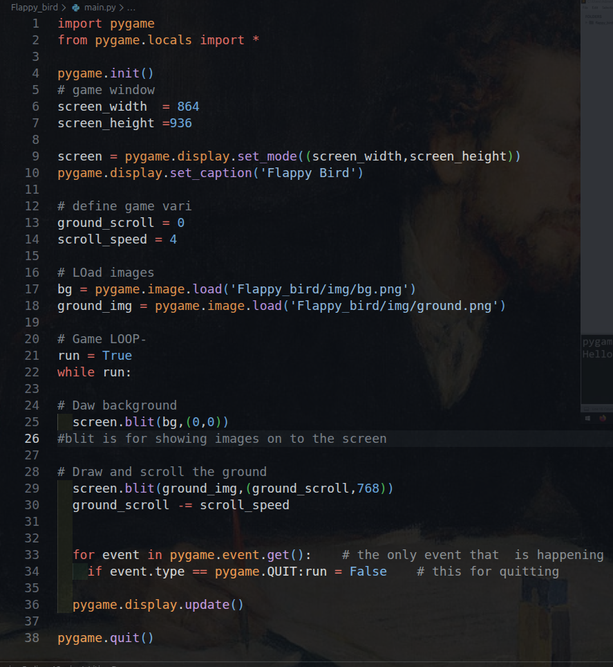
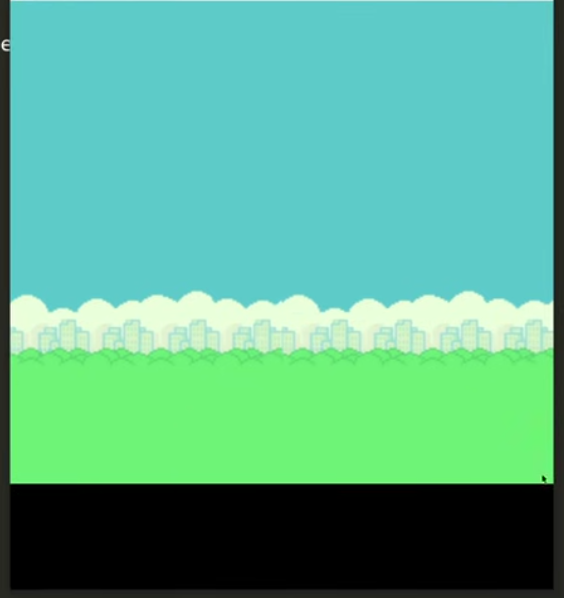

# Game-Dev -1 Documentation

This is me starting to work on my First Game - Flappy Bird,  
I am new in this field, so while developing I am learning Pygame too,  
and by that I'll try to document it.

We start with the imports (that's obvious): `import pygame`.

After `import pygame`, we set up the clock and fps, so we can control how fast the game runs.

```python
clock = pygame.time.Clock()
fps = 60  # frame rate
```

Then we define the size of our game window: the width and height of the screen.

```python
# game window
screen_width = 864
screen_height = 936
```

Then we set up the display and its title.

```python
screen = pygame.display.set_mode((screen_width, screen_height))
pygame.display.set_caption("Flappy Bird")
```

Now we define some game variables. We will use these to scroll the ground image.

```python
ground_scroll = 0
scroll_speed = 4
```

After that, we load our images.

```python
bg = pygame.image.load("Flappy_bird/img/bg.png")
ground_img = pygame.image.load("Flappy_bird/img/ground.png")
```

Now the main part: we create the `Bird` class (this is our player).

```python
class Bird(pygame.sprite.Sprite):
    def __init__(self, x, y):
        pygame.sprite.Sprite.__init__(self)
        self.images = []     # empty list for animation frames
        self.index = 0       # which image to show
        self.counter = 0     # animation speed counter
        for num in range(1, 4):
            img = pygame.image.load(f"Flappy_bird/img/bird{num}.png")
            self.images.append(img)
        self.image = self.images[self.index]
        self.rect = self.image.get_rect()
        self.rect.center = [x, y]

    def update(self):
        # handle the animation of bird
        self.counter += 1
        flap_cooldown = 5
        if self.counter > flap_cooldown:
            self.counter = 0
            self.index += 1
            # this keeps the bird animation looping
            if self.index >= len(self.images):
                self.index = 0
        self.image = self.images[self.index]
```

We create a group, make one bird, and add it to the group:

```python
bird_group = pygame.sprite.Group()
flappy = Bird(100, int(screen_height / 2))
bird_group.add(flappy)
```

After that, we define our game loop, which handles all the events that happen in the game.

Next we write:

```python
run = True
while run:
```

Now, with all of this, our code looks like this:




**Let me explain this code:**

- Inside the `while` loop, everything below it runs every frame. That is the main game loop.
- `for event in pygame.event.get():` is the event handler loop. `if event.type == pygame.QUIT: run = False` handles quitting the game when we click the "X" button.
- We load the images, then use `blit` to draw the background image at `(0, 0)` (I don't know the coordinates yet, so we will cover it later).
- We draw our ground image. If you are wondering what I mean by ground, it is the black strip below the background image:



- We draw our ground and scroll it (this means the ground image moves) [scrolling is the movement of the ground image]. I still do not know how the exact coordinates were picked, so we will cover that later.
- To move the `ground_img`, we adjust the `x` coordinate using the `ground_scroll` variable. To move right, we increase `x` (starts at 0). To move left, we decrease it.
- To keep the movement smooth, we use `scroll_speed` to move the image by 4 pixels per frame.
- When the ground image moves too far, we reset it back to `0` so the scrolling stays clean.
- If the movement is too fast, we can lower `scroll_speed` later. This is just to explain the code snippet.
