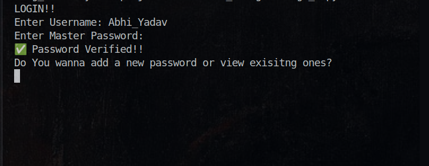

# Stage 2 – Master Password & Hashing

## Objective
Improve the security of the password manager by adding
a **master login system** using hashing and salting.

This stage focuses on authentication before allowing access
to stored passwords.

---

## Features Implemented
- Master username & master password system
- Secure input using `getpass`
- Hashing using `SHA-256`
- Salting applied before hashing
- Master credentials stored as hashed values in JSON
- Login verification using hash comparison

---

## What Changed from Stage 1
The following limitations from **Stage 1** are addressed:

- ❌ No authentication  
  ✅ **Master password authentication added**

- ❌ Anyone could access stored passwords  
  ✅ **Access allowed only after successful login**

---

## Technical Details
- Language: Python
- Hashing: `hashlib (SHA-256)`
- Salting: Fixed salt (for learning purpose)
- Storage:
  - `master_password.json` → stores hashed credentials (gitignored)
  - `master_password.example.json` → dummy structure for GitHub

---

## Security Notes
- Real credential files are **not committed** to GitHub
- Only dummy/example JSON files are included for demonstration
- Actual secrets are ignored using `.gitignore`

---

## Limitations
- Fixed salt (not user-specific)
- No encryption of stored passwords yet
- No account lockout after failed attempts
- CLI-based (no GUI)

---

## Next Stage (Stage 3)
- Encrypt stored passwords
- Decrypt only after successful master login
- Improve overall security design

---

## Sample Output

Below are sample CLI outputs demonstrating the master
password authentication flow.

### Successful Login

### Failed Login

